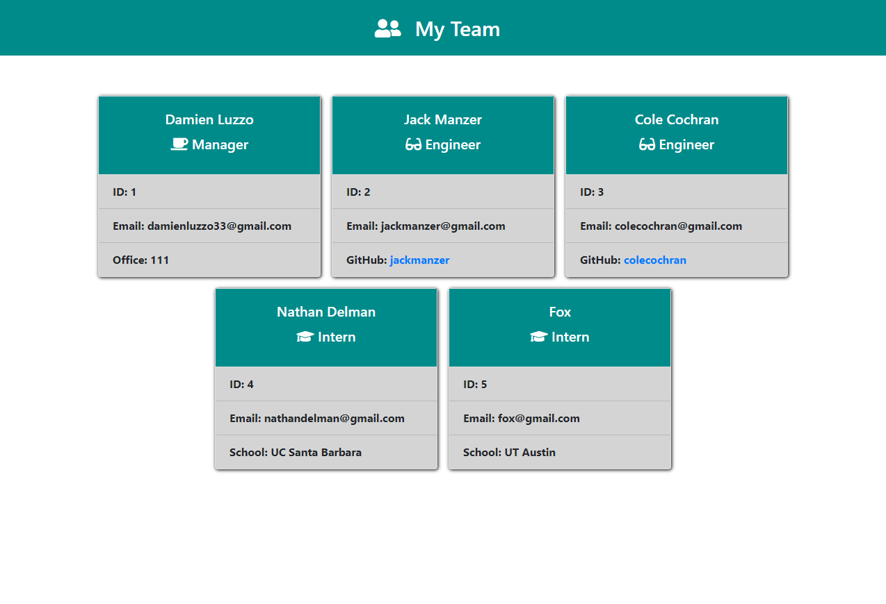
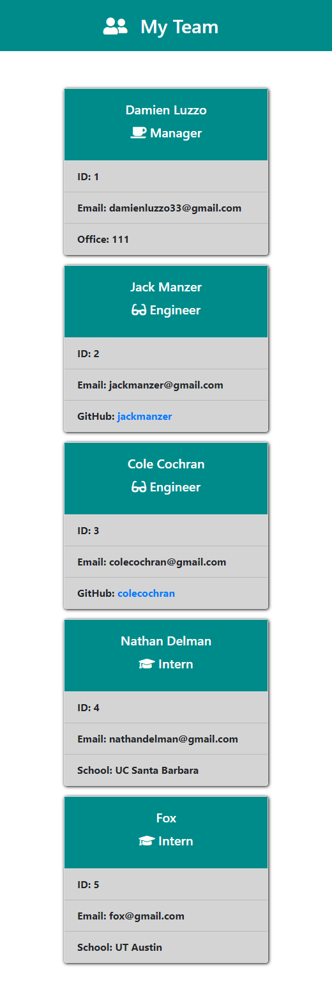

# Team-Profile-Generator-App

## Description

Today's team-driven environment demands simple ways to display and store information about your team members and their roles. This Team Profile Generator was created to make the process of creating a webpage that displays your team members simple for anyone regardless of their coding experience.

Knowledge of HTML isn't needed in order to use this app. Simply launch the app in your console, answer some simple questions about your team members, and watch the document render itself for you. Tired of needing to relearn HTML every time you want to create a basic HTML document? Then use the Team Profile Generator and keep your stress at bay.

If you are interested in improving or modifying this application for your own personal usage, please go ahead and clone down the repository and transform it into your own amazing Team Profile Generator.

>Enter giphy demo here

## Table of Contents

- [Installation](#installation)
- [Usage](#usage)
- [Credits](#credits)
- [License](#license)
- [Features](#features)
- [Examples/Tests](#examples)

## Installation

- To install the app, simply clone down this repository to your local machine.

## Usage

- To use the application, just navigate to the cloned down repository, and run "npm i" to get the necessary node modules

- Next, simply initiate the application by running "node index.js" in your console

Screenshots:

Desktop:

Mobile:

## Credits

Assets:

+ [inquirer by Simon Boudrias](https://github.com/SBoudrias/Inquirer.js)

+ [jest by jest](https://jestjs.io/)

Tutorials:

+ [How To Use Inquirer.js](https://javascript.plainenglish.io/how-to-inquirer-js-c10a4e05ef1f)

## License

+ MIT

## Features

+ User is able to submit responses to various prompts that will be used to generate an index.html document that displays the team members they entered in the console

+ Prompts are dynamic and allow the user to enter as many team members that they want to

+ The HTML document that is generated is properly formatted, equipped with bootstrap styles, and ready for use immediately after the user completes all prompted questions

+ The HTML page that is generated is responsive and formatted to fit any screen size

## How to Contribute

If you would like to contribute to this Team Profile Generator project, please feel free to clone or fork this repository and implement your desired improvements. Once your improvements have been made and the app has been tested properly, please feel free to send me a message on github with a short summary of the changes you've made and I will invite you to be a collaborator.

## Examples

Validators are in place to prevent you from inputting incorrect response types, so all you have to do to use this application is follow the prompts and submit your responses to the questions.

To see an example for how to answer the questions, and what the generated HTML document should look like, please refer to the video in the description above.

## Questions

Connect with me on GitHub: [damienluzzo33](https://www.github.com/damienluzzo33)

Shoot me an email: [damienluzzo33@gmail.com](mailto:damienluzzo33@gmail.com)
